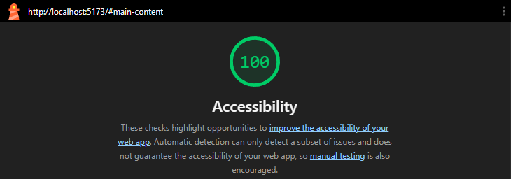

# Web LAB-2: Semantik HTML ve Erişilebilirlik

## Hakkında

Bu proje, Web Tasarımı ve Programlama dersi LAB-2 kapsamında Semantik HTML5, Erişilebilirlik (a11y) ve Form Temelleri kullanılarak güncellenmiştir.

## Geliştirici

**Ad Soyad:** Atahan Bora Bozkurt

**Öğrenci No:** 230541151

## Kullanılan Teknolojiler

- React 18 + TypeScript + Vite
- Semantik HTML5
- ARIA Öznitelikleri ve a11y Pratikleri

## Çalıştırma

```bash
npm install
npm run dev
```

## Lighthouse Erişilebilirlik Testi


